# Mermaid Diagram Templates

Ready-to-use Mermaid diagrams for documentation.

## System Architecture

### Microservices Architecture

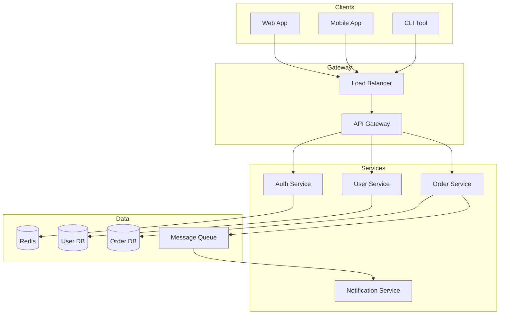

### Monolith Architecture

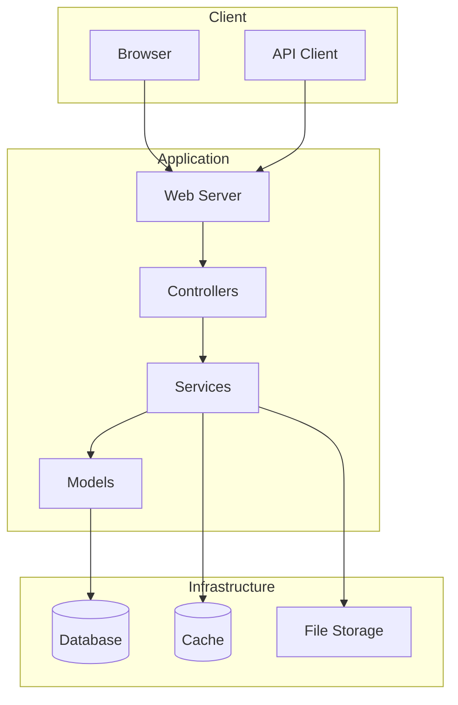

### Three-Tier Architecture

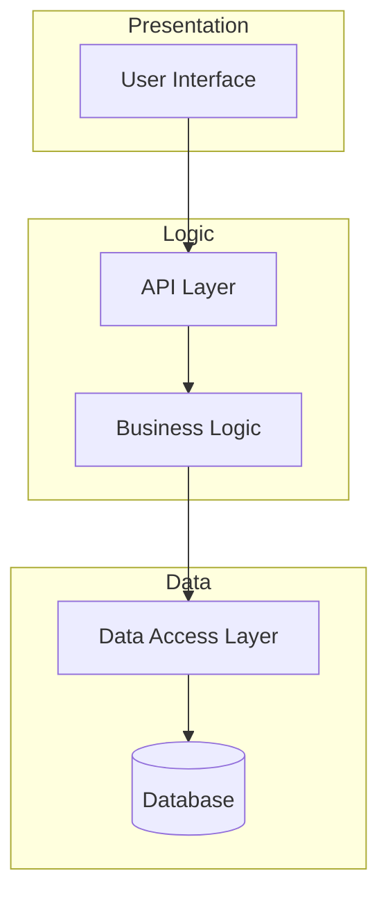

## Sequence Diagrams

### Authentication Flow

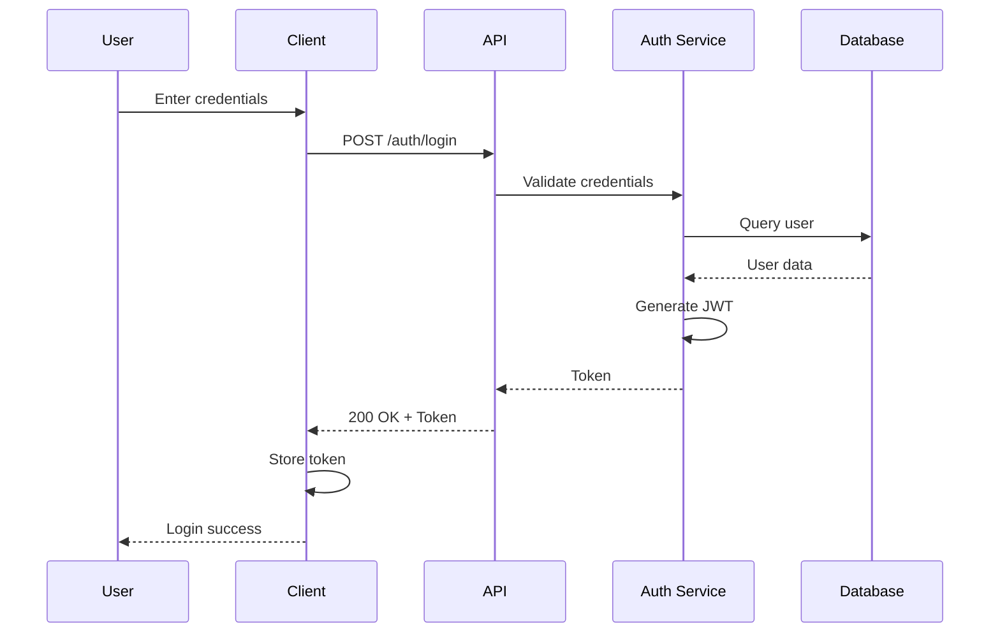

### API Request Flow

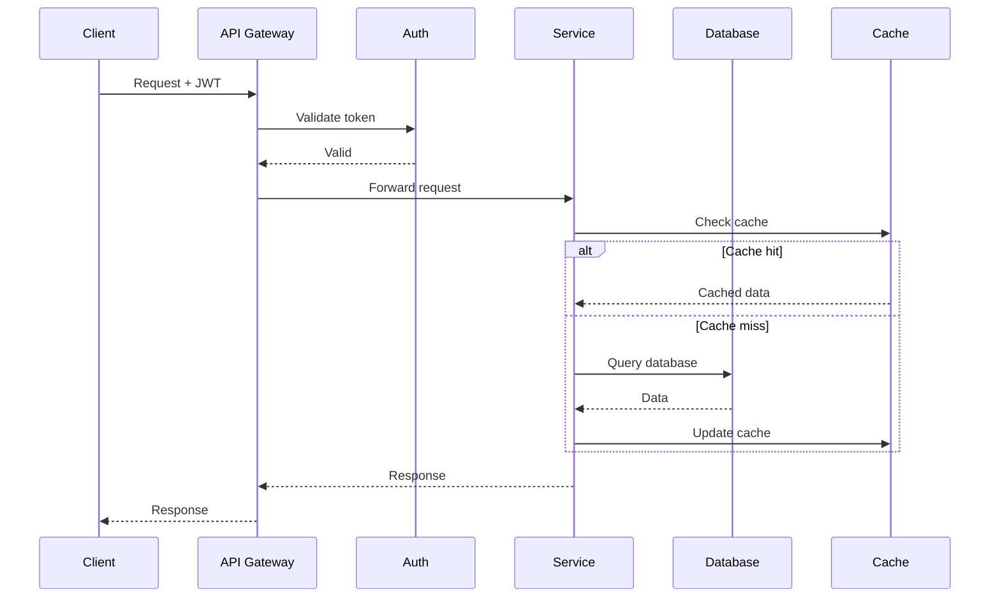

### Error Handling Flow

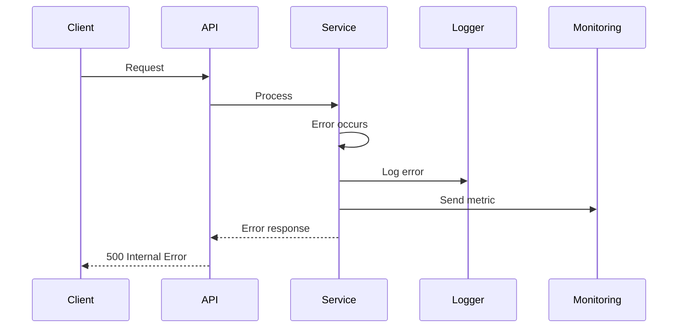

## Entity Relationship Diagrams

### User Management Schema

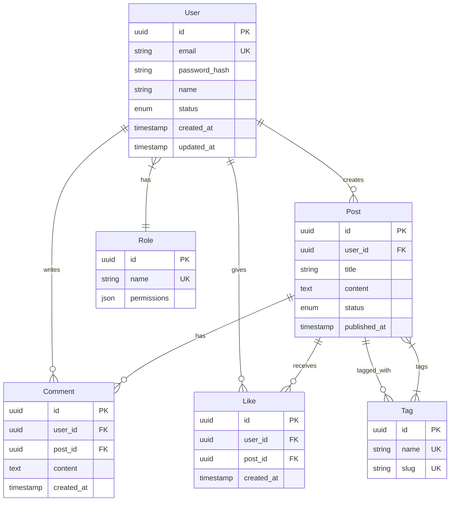

### E-commerce Schema

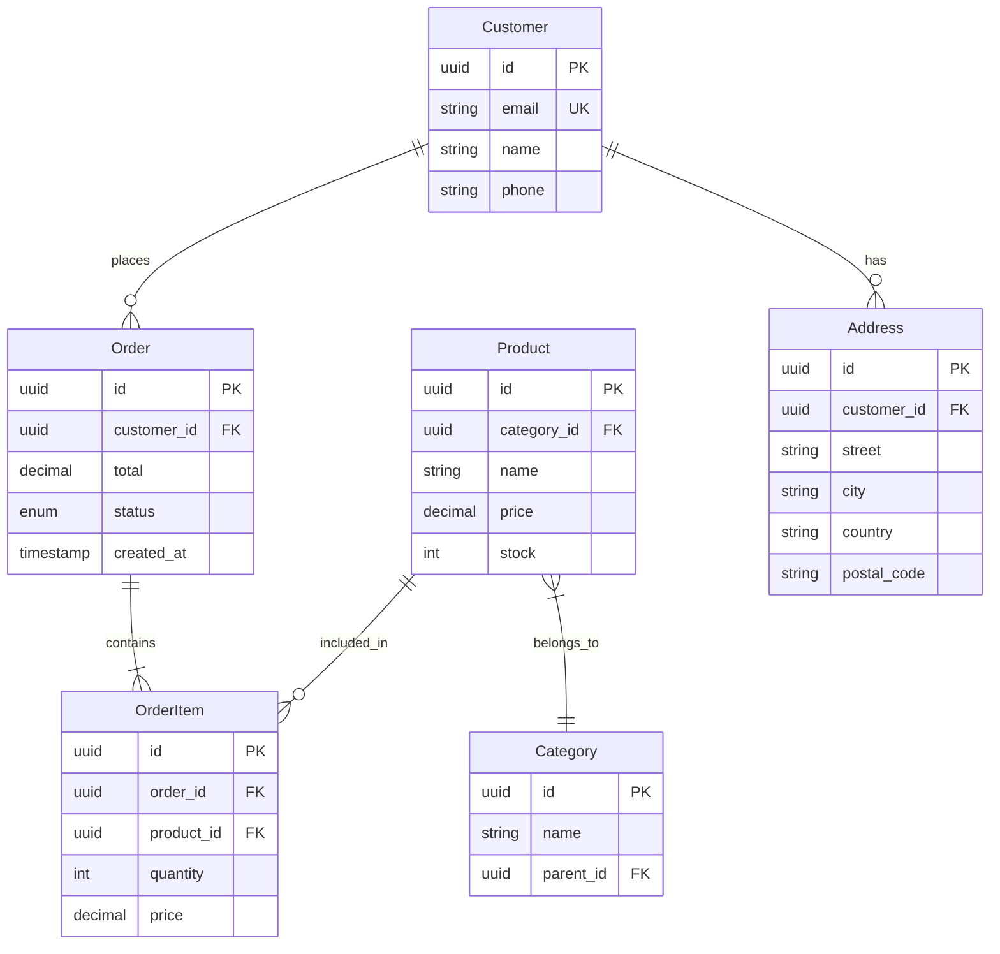

## Flowcharts

### CI/CD Pipeline

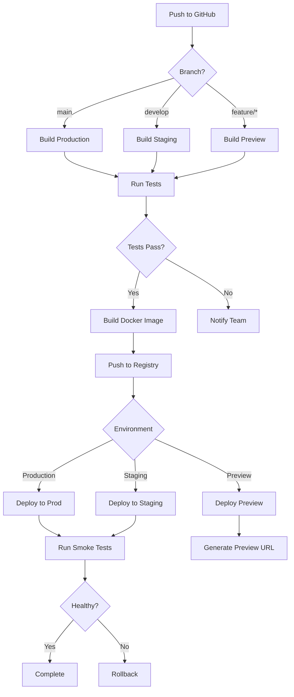

### User Registration Flow

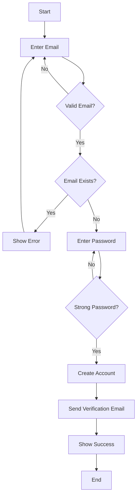

### Error Handling Decision Tree

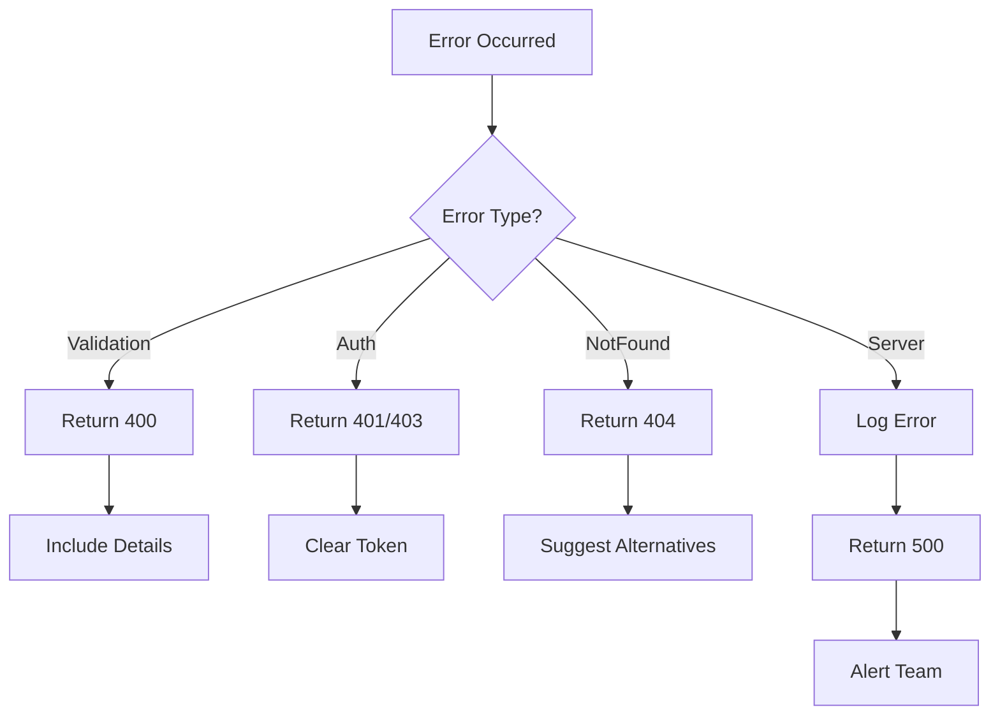

## State Diagrams

### Order Status

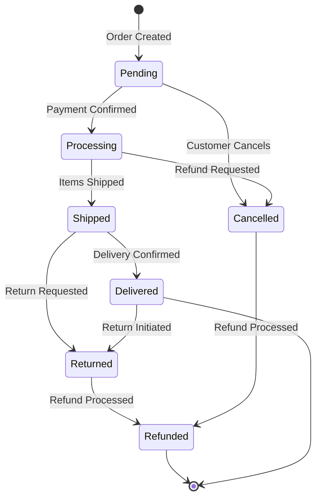

### User Account Status

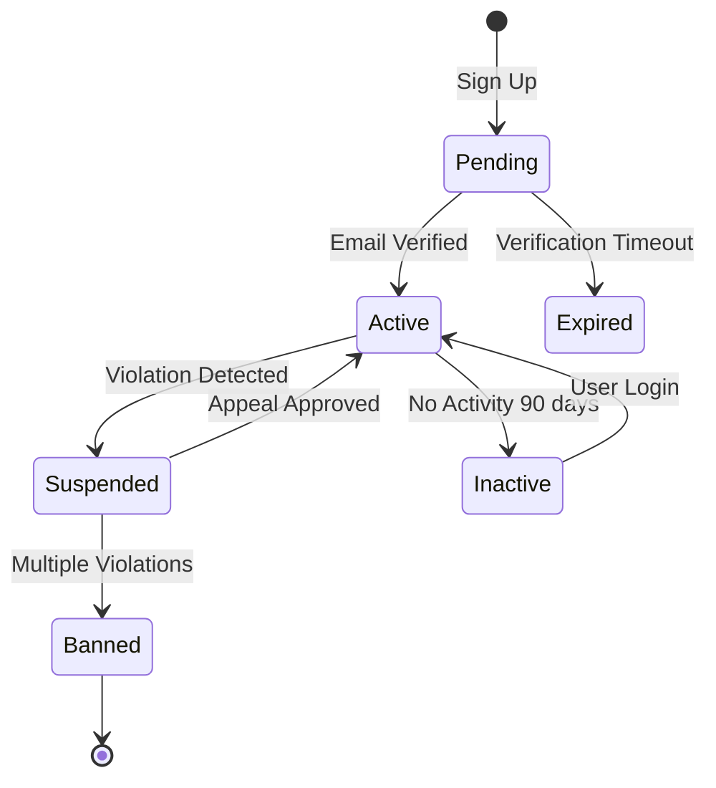

## Class Diagrams

### Service Layer Pattern

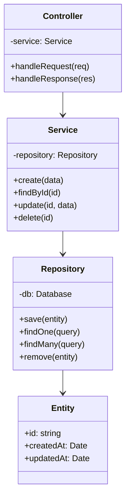

## Gantt Charts

### Project Timeline

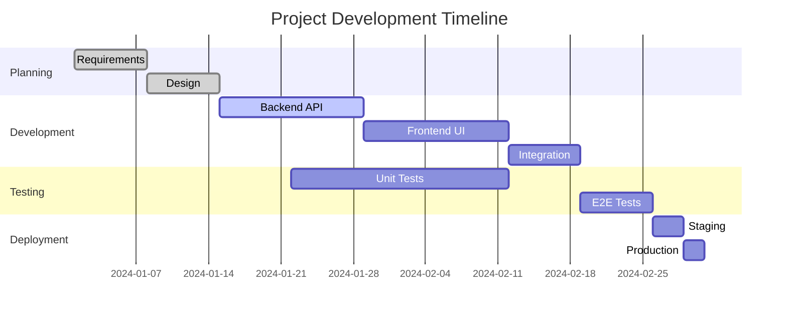

## Usage Tips

1. **Keep diagrams simple** - Max 15-20 nodes per diagram
2. **Use meaningful labels** - Short but descriptive
3. **Group related items** - Use subgraphs/containers
4. **Consistent direction** - TB (top-bottom) or LR (left-right)
5. **Color sparingly** - Only for emphasis
