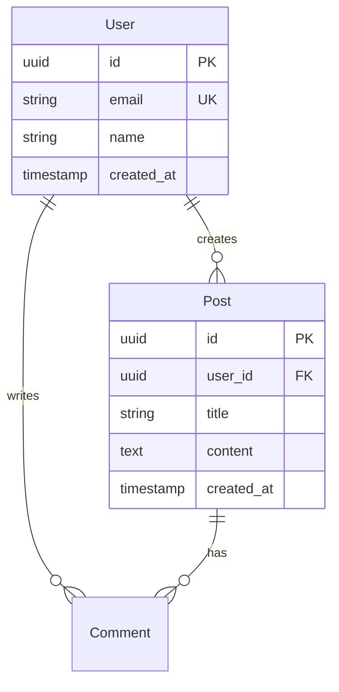

# Document Templates

Ready-to-use templates for each documentation file.

## README.md Template

````markdown
# Project Name


One-paragraph description explaining what the project does, who it's for, and why it exists.

## Quick Start

Get up and running in under 5 minutes.

### Prerequisites

- Node.js >= 18.x (or Python >= 3.10)
- PostgreSQL >= 14
- Docker (optional)

### Installation

```bash
# Clone the repository
git clone https://github.com/org/project.git
cd project

# Install dependencies
npm install

# Set up environment
cp .env.example .env
# Edit .env with your configuration

# Run database migrations
npm run db:migrate

# Start the application
npm run dev
```
````

Visit `http://localhost:3000` to see the app.

## Tech Stack

| Category  | Technology | Version |
| --------- | ---------- | ------- |
| Language  | TypeScript | 5.x     |
| Framework | Next.js    | 14.x    |
| Database  | PostgreSQL | 14.x    |
| Cache     | Redis      | 7.x     |
| ORM       | Prisma     | 5.x     |

## Project Structure

```
project/
├── src/
│   ├── app/           # Next.js app router
│   ├── components/    # React components
│   ├── lib/           # Utility functions
│   └── services/      # Business logic
├── prisma/            # Database schema
├── tests/             # Test files
└── docs/              # Documentation
```

## Documentation

- [Contributing Guide](./CONTRIBUTING.md)
- [Architecture](./ARCHITECTURE.md)
- [API Reference](./API.md)
- [Deployment](./DEPLOYMENT.md)

## License

[MIT](./LICENSE)

````

## CONTRIBUTING.md Template

```markdown
# Contributing Guide

Thank you for your interest in contributing!

## Development Setup

### Prerequisites

- Node.js 18+
- pnpm (recommended) or npm
- Docker for local services

### Local Development

1. Fork and clone the repository
2. Install dependencies:
   ```bash
   pnpm install
````

3. Set up environment:
   ```bash
   cp .env.example .env
   ```
4. Start development services:
   ```bash
   docker-compose up -d
   ```
5. Run the development server:
   ```bash
   pnpm dev
   ```

## Code Style

We use ESLint and Prettier for code formatting.

```bash
# Check formatting
pnpm lint

# Auto-fix issues
pnpm lint:fix
```

### Guidelines

- Use TypeScript strict mode
- Write meaningful variable names
- Add JSDoc comments for public APIs
- Keep functions under 50 lines

## Git Workflow

### Branch Naming

```
feature/add-user-auth
bugfix/fix-login-error
hotfix/security-patch
docs/update-readme
```

### Commit Messages

Follow [Conventional Commits](https://www.conventionalcommits.org/):

```
feat(auth): add JWT token refresh
fix(api): handle null response gracefully
docs(readme): update installation steps
test(users): add unit tests for user service
```

## Pull Request Process

1. Create a feature branch from `main`
2. Make your changes with tests
3. Run the test suite: `pnpm test`
4. Update documentation if needed
5. Submit PR using the template below

### PR Template

```markdown
## Summary

Brief description of changes

## Type

- [ ] Feature
- [ ] Bug fix
- [ ] Documentation
- [ ] Refactor

## Testing

- [ ] Unit tests added/updated
- [ ] Integration tests pass
- [ ] Manual testing completed

## Checklist

- [ ] Code follows style guide
- [ ] Self-review completed
- [ ] No console.log statements
- [ ] Types are properly defined
```

## Testing

```bash
# Run all tests
pnpm test

# Run with coverage
pnpm test:coverage

# Run specific test file
pnpm test -- users.test.ts
```

## Questions?

Open a GitHub issue or reach out to the maintainers.

````

## ARCHITECTURE.md Template

```markdown
# Architecture

System architecture and design decisions.

## Overview

```mermaid
graph TB
    subgraph Client
        Web[Web App]
        Mobile[Mobile App]
    end

    subgraph Backend
        API[API Gateway]
        Auth[Auth Service]
        Core[Core Service]
        Worker[Background Worker]
    end

    subgraph Data
        DB[(PostgreSQL)]
        Cache[(Redis)]
        Queue[Message Queue]
    end

    Web --> API
    Mobile --> API
    API --> Auth
    API --> Core
    Core --> DB
    Core --> Cache
    Core --> Queue
    Queue --> Worker
````

## Components

| Component    | Purpose         | Technology  |
| ------------ | --------------- | ----------- |
| Web App      | User interface  | Next.js     |
| API Gateway  | Request routing | Express     |
| Auth Service | Authentication  | Passport.js |
| Core Service | Business logic  | Node.js     |
| Worker       | Background jobs | Bull        |

## Data Flow

### Authentication Flow

```mermaid
sequenceDiagram
    Client->>+API: POST /auth/login
    API->>+Auth: Validate credentials
    Auth->>+DB: Query user
    DB-->>-Auth: User data
    Auth-->>-API: JWT token
    API-->>-Client: Token + user
```

### Request Processing

1. Client sends request to API Gateway
2. Gateway validates JWT token
3. Request routed to appropriate service
4. Service processes and queries database
5. Response cached if applicable
6. Response returned to client

## Database Schema



## Design Decisions

### ADR-001: Use PostgreSQL

**Context**: Need reliable, scalable database
**Decision**: PostgreSQL with Prisma ORM
**Rationale**: Strong typing, ACID compliance, JSON support

### ADR-002: API Design

**Context**: Need consistent API structure
**Decision**: REST with OpenAPI specification
**Rationale**: Industry standard, good tooling support

## Security

- JWT tokens for authentication
- Rate limiting on all endpoints
- Input validation with Zod
- SQL injection prevention via ORM
- CORS configured for allowed origins

````

## API.md Template

```markdown
# API Reference

Complete API documentation.

## Base URL

````

Production: https://api.example.com/v1
Staging: https://staging-api.example.com/v1

````

## Authentication

All endpoints require JWT authentication unless marked as public.

```http
Authorization: Bearer <token>
````

### Get Token

```http
POST /auth/login
Content-Type: application/json

{
  "email": "user@example.com",
  "password": "secret"
}
```

**Response 200**

```json
{
  "token": "eyJhbG...",
  "expiresIn": 3600,
  "user": {
    "id": "123",
    "email": "user@example.com"
  }
}
```

## Endpoints

### Users

#### Get Current User

```http
GET /users/me
Authorization: Bearer <token>
```

**Response 200**

```json
{
  "id": "123",
  "email": "user@example.com",
  "name": "John Doe",
  "createdAt": "2024-01-01T00:00:00Z"
}
```

#### Update User

```http
PATCH /users/me
Authorization: Bearer <token>
Content-Type: application/json

{
  "name": "Jane Doe"
}
```

### Posts

#### List Posts

```http
GET /posts?page=1&limit=10
```

**Query Parameters**
| Param | Type | Default | Description |
|-------|------|---------|-------------|
| page | int | 1 | Page number |
| limit | int | 10 | Items per page |
| sort | string | -createdAt | Sort order |

**Response 200**

```json
{
  "data": [...],
  "pagination": {
    "page": 1,
    "limit": 10,
    "total": 100,
    "pages": 10
  }
}
```

## Error Codes

| Code | Message           | Description              |
| ---- | ----------------- | ------------------------ |
| 400  | Bad Request       | Invalid input            |
| 401  | Unauthorized      | Missing/invalid token    |
| 403  | Forbidden         | Insufficient permissions |
| 404  | Not Found         | Resource not found       |
| 429  | Too Many Requests | Rate limit exceeded      |
| 500  | Internal Error    | Server error             |

## Rate Limiting

- 100 requests per minute per IP
- 1000 requests per hour per user
- Headers: `X-RateLimit-Remaining`, `X-RateLimit-Reset`

````

## DEPLOYMENT.md Template

```markdown
# Deployment Guide

Step-by-step deployment instructions.

## Environments

| Environment | URL | Branch | Purpose |
|-------------|-----|--------|---------|
| Development | localhost:3000 | - | Local dev |
| Staging | staging.example.com | develop | Testing |
| Production | app.example.com | main | Live |

## Prerequisites

- Docker 20.10+
- kubectl configured
- AWS CLI configured
- Access to secrets manager

## Environment Variables

| Variable | Required | Description | Example |
|----------|----------|-------------|---------|
| DATABASE_URL | Yes | Database connection | postgres://... |
| REDIS_URL | Yes | Redis connection | redis://... |
| JWT_SECRET | Yes | Token signing key | random-32-chars |
| AWS_REGION | Yes | AWS region | us-east-1 |

## Deployment Steps

### 1. Build

```bash
# Build Docker image
docker build -t app:latest .

# Tag for registry
docker tag app:latest registry.example.com/app:v1.0.0
````

### 2. Push

```bash
# Push to registry
docker push registry.example.com/app:v1.0.0
```

### 3. Deploy

```bash
# Update Kubernetes deployment
kubectl set image deployment/app app=registry.example.com/app:v1.0.0

# Wait for rollout
kubectl rollout status deployment/app
```

### 4. Verify

```bash
# Check pods
kubectl get pods -l app=app

# Check logs
kubectl logs -l app=app --tail=100

# Test health endpoint
curl https://app.example.com/health
```

## Rollback

```bash
# Rollback to previous version
kubectl rollout undo deployment/app

# Rollback to specific revision
kubectl rollout undo deployment/app --to-revision=2
```

## CI/CD Pipeline

```yaml
# .github/workflows/deploy.yml
name: Deploy
on:
  push:
    branches: [main]

jobs:
  deploy:
    runs-on: ubuntu-latest
    steps:
      - uses: actions/checkout@v4
      - name: Build and push
        run: |
          docker build -t app .
          docker push registry/app:${{ github.sha }}
      - name: Deploy
        run: kubectl set image deployment/app app=registry/app:${{ github.sha }}
```

## Monitoring

- **Logs**: CloudWatch / Datadog
- **Metrics**: Prometheus / Grafana
- **Alerts**: PagerDuty
- **APM**: New Relic / Datadog APM

```

```
