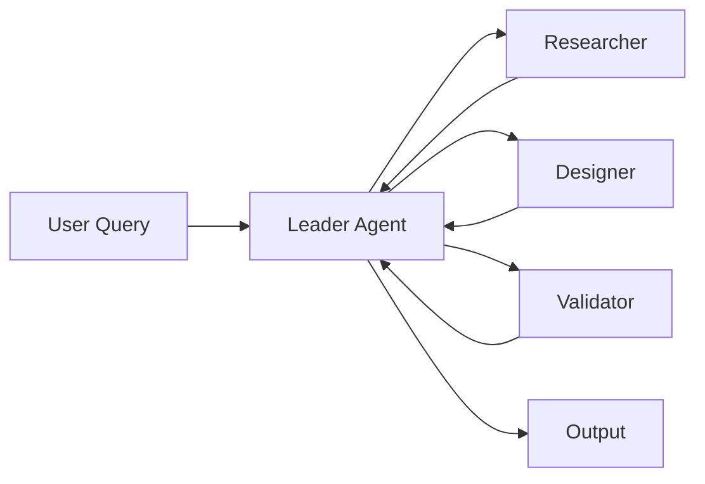

# 4-D Framework Reference

## DECONSTRUCT (분해)

### Entity Extraction Protocol

```python
def extract_entities(query: str) -> dict:
    return {
        "intent": extract_verb_object(query),      # 핵심 의도
        "entities": extract_nouns(query),          # 키 엔티티
        "constraints": extract_negations(query),   # 제약 조건
        "success_criteria": infer_output(query),   # 성공 지표
        "context_gaps": identify_missing(query)    # 누락 정보
    }
```

### Information Assessment Matrix

| 제공됨 | 필요함        | 갭 해결 방법    |
| ------ | ------------- | --------------- |
| 목표   | 성공 지표     | 소크라테스 질문 |
| 도메인 | 세부 컨텍스트 | 웹 검색         |
| 형식   | 예시          | Few-shot 생성   |

### Socratic Question Bank

**의도 명확화:**

- "이 결과물로 어떤 문제가 해결되나?"
- "성공적 결과의 구체적 모습은?"

**제약 파악:**

- "절대 피해야 할 것은?"
- "시간/리소스 제약은?"

**맥락 확장:**

- "이 작업의 상위 목표는?"
- "결과물의 소비자는 누구?"

## DIAGNOSE (진단)

### Clarity Score Rubric

| 점수 | 기준                                         |
| ---- | -------------------------------------------- |
| 9-10 | 의도/제약/출력형식 모두 명확, 즉시 실행 가능 |
| 7-8  | 핵심 의도 명확, 세부사항 일부 추론 필요      |
| 5-6  | 대략적 방향 파악 가능, 다수 질문 필요        |
| 3-4  | 모호함, 주요 요소 누락                       |
| 1-2  | 해석 불가, 전면 재작성 필요                  |

### Specificity Score Rubric

| 점수 | 기준                       |
| ---- | -------------------------- |
| 9-10 | 수치, 범위, 예시 모두 포함 |
| 7-8  | 대부분 구체적, 일부 추상적 |
| 5-6  | 절반 수준 구체성           |
| 3-4  | 대부분 추상적              |
| 1-2  | 완전 추상적                |

### Gap Types & Solutions

| 갭 유형       | 증상           | 해결책          |
| ------------- | -------------- | --------------- |
| 컨텍스트 부족 | 배경 정보 없음 | WebSearch, 질문 |
| 제약 부재     | 무한 가능성    | 범위 질문       |
| 형식 미정     | 출력 불명확    | 예시 요청       |
| 도메인 미상   | 전문성 필요    | 도메인 탐색     |

## DEVELOP (개발)

### SMART Goal Template

```markdown
**Specific**: [구체적 목표]
**Measurable**: [측정 방법]
**Achievable**: [달성 가능성 근거]
**Relevant**: [상위 목표와의 연관성]
**Time-bound**: [완료 기준/조건]
```

### Prompt Structure (RCTS)

```markdown
[ROLE]
너는 {역할}이다. {역할의 전문성/특징}.

[CONTEXT]

- 배경: {배경 정보}
- 제약: {제약 조건}
- 참고: {관련 자료/예시}

[TASK]
{구체적 작업 지시}

- 단계 1: ...
- 단계 2: ...
- 단계 3: ...

[SPEC]
출력 형식: {형식 명세}
길이: {길이 제약}
스타일: {스타일 가이드}
```

### Multi-Agent Orchestration Pattern



## DELIVER (전달)

### Output Quality Checklist

- [ ] 핵심 의도 반영됨
- [ ] 모든 제약 조건 준수
- [ ] 출력 형식 일치
- [ ] 실행 가능한 수준
- [ ] 자기 검증 포함

### Iteration Decision Tree

```
결과 만족도 < 7?
  └─ Yes → 어느 단계 문제?
       ├─ 의도 오해 → DECONSTRUCT 재실행
       ├─ 정보 부족 → DIAGNOSE 강화
       ├─ 설계 미흡 → DEVELOP 재설계
       └─ 형식 불일치 → DELIVER 수정
  └─ No → 완료 또는 추가 세부화
```
