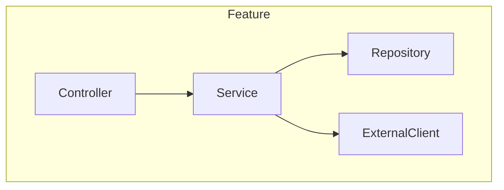

# Feature Spec Dev 2

Premium spec-driven development skill with real-time research, deep intent analysis, and strict verification.

## Architecture Overview

```
┌──────────────────────────────────────────────────────────────────────────┐
│                    SPEC-DRIVEN DEVELOPMENT ORCHESTRATOR                   │
├──────────────────────────────────────────────────────────────────────────┤
│ Phase 1: DISCOVER ──► Deep intent analysis + real-time research          │
│   └── IntentAnalyzer Agent (AskUserQuestion probing)                     │
│   └── TrendResearcher Agent (WebSearch tech trends 2025)                 │
│   └── CaseStudyFinder Agent (similar implementations)                    │
│   └── Save to .spec-docs/discovery/                                      │
├──────────────────────────────────────────────────────────────────────────┤
│ Phase 2: ANALYZE ──► Requirements in EARS format + API research          │
│   └── RequirementExtractor Agent (explicit + implicit needs)             │
│   └── APIResearcher Agent (WebSearch libraries/APIs)                     │
│   └── Save to .spec-docs/requirements/                                   │
├──────────────────────────────────────────────────────────────────────────┤
│ Phase 3: DESIGN ──► Architecture + component design                      │
│   └── ArchitectureDesigner Agent (patterns, structure)                   │
│   └── ComponentMapper Agent (interfaces, data models)                    │
│   └── Save to .spec-docs/design/                                         │
├──────────────────────────────────────────────────────────────────────────┤
│ Phase 4: PLAN ──► Task breakdown + dependency mapping                    │
│   └── TaskGenerator Agent (atomic implementation tasks)                  │
│   └── DependencyMapper Agent (task ordering, blockers)                   │
│   └── Save to .spec-docs/tasks/                                          │
├──────────────────────────────────────────────────────────────────────────┤
│ Phase 5: VERIFY ──► Pre-task verification + gap detection                │
│   └── VerificationAgent (check previous task completion)                 │
│   └── GapDetector Agent (incomplete items → re-add to plan)              │
│   └── Save to .spec-docs/tracking/                                       │
└──────────────────────────────────────────────────────────────────────────┘
```

## Quick Start

```bash
# Start new feature spec
/spec-start "사용자 인증 시스템"

# Get next implementation task (with verification)
/spec-next

# Check implementation status
/spec-check

# Search documentation
/spec-search "authentication"

# View current progress
/spec-status
```

## Document Persistence Structure

All outputs saved to `.spec-docs/` directory:

```
.spec-docs/
├── index.md                      # Searchable index
├── config.json                   # Project configuration
│
├── discovery/                    # Phase 1 outputs
│   ├── intent_analysis.md        # Deep intent extraction
│   ├── tech_trends.md            # 2025 technology research
│   ├── case_studies.md           # Similar implementation analysis
│   └── user_decisions.md         # AskUserQuestion responses
│
├── requirements/                 # Phase 2 outputs
│   ├── requirements.md           # EARS format requirements
│   ├── api_research.md           # Library/API documentation
│   └── constraints.md            # Technical constraints
│
├── design/                       # Phase 3 outputs
│   ├── architecture.md           # System architecture
│   ├── components.md             # Component specifications
│   ├── data_models.md            # Data structures
│   └── interfaces.md             # API contracts
│
├── tasks/                        # Phase 4 outputs
│   ├── task_breakdown.md         # Master task list
│   ├── TASK-001.md               # Individual task files
│   ├── TASK-002.md
│   └── ...
│
└── tracking/                     # Phase 5 outputs
    ├── completion_status.json    # Task completion tracking
    ├── verification_log.md       # Verification history
    └── gaps_report.md            # Incomplete task log
```

## Phase 1: DISCOVER

### Deep Intent Analysis

Use AskUserQuestion to probe beyond surface-level requests:

```
AskUserQuestion(questions=[
  {
    "question": "이 기능의 핵심 목적은 무엇인가요?",
    "header": "Core Purpose",
    "options": [
      {"label": "사용자 경험 개선", "description": "UI/UX, 편의성, 접근성"},
      {"label": "비즈니스 로직 구현", "description": "핵심 도메인 기능"},
      {"label": "시스템 인프라", "description": "성능, 보안, 확장성"},
      {"label": "통합/연동", "description": "외부 API, 서비스 연결"}
    ],
    "multiSelect": true
  },
  {
    "question": "가장 중요한 성공 기준은?",
    "header": "Success Criteria",
    "options": [
      {"label": "기능 완성도", "description": "모든 요구사항 충족"},
      {"label": "성능", "description": "응답 시간, 처리량"},
      {"label": "유지보수성", "description": "확장, 수정 용이성"},
      {"label": "보안", "description": "취약점 없음, 규정 준수"}
    ],
    "multiSelect": false
  },
  {
    "question": "명시하지 않았지만 암묵적으로 기대하는 것은?",
    "header": "Implicit Needs",
    "options": [
      {"label": "에러 처리 완비", "description": "모든 예외 상황 대응"},
      {"label": "테스트 코드 포함", "description": "단위/통합 테스트"},
      {"label": "문서화", "description": "API 문서, 사용 가이드"},
      {"label": "기존 코드와 일관성", "description": "프로젝트 컨벤션 준수"}
    ],
    "multiSelect": true
  }
])
```

### Real-Time Research (Parallel Agents)

```
# Agent 1: Technology Trends 2025
Task(
  subagent_type='Explore',
  prompt='''Use WebSearch to research:
    - "{feature_domain} best practices 2025"
    - "{feature_domain} architecture patterns"
    - "{tech_stack} {feature_type} implementation"

    Return: latest trends, recommended patterns, pitfalls to avoid''',
  model='haiku',
  run_in_background=true,
  description='Research tech trends'
)

# Agent 2: Similar Implementations
Task(
  subagent_type='Explore',
  prompt='''Use WebSearch to find:
    - "open source {feature_type} implementation"
    - "{feature_domain} github example"
    - "{tech_stack} {feature_type} tutorial"

    Return: reference implementations, code patterns, lessons learned''',
  model='haiku',
  run_in_background=true,
  description='Find case studies'
)

# Agent 3: API/Library Research
Task(
  subagent_type='Explore',
  prompt='''Use WebSearch to research:
    - "{tech_stack} {feature_domain} libraries 2025"
    - "{feature_type} npm/pip packages comparison"
    - Official documentation for relevant APIs

    Return: recommended libraries, API reference, integration patterns''',
  model='haiku',
  run_in_background=true,
  description='Research APIs'
)
```

Save all findings to `.spec-docs/discovery/`.

## Phase 2: ANALYZE (Requirements)

### Generate Requirements in EARS Format

```markdown
# Requirements: {feature_name}

## Overview

{feature_summary_from_discovery}

## Functional Requirements

### FR-1: {requirement_name}

- **EARS Format**: WHEN {event} THEN {system} SHALL {response}
- **Priority**: High/Medium/Low
- **Source**: User request / Implicit need / Research finding
- **Acceptance Criteria**:
  - [ ] Criterion 1
  - [ ] Criterion 2

### FR-2: {requirement_name}

- **EARS Format**: IF {precondition} THEN {system} SHALL {response}
  ...

## Non-Functional Requirements

### NFR-1: Performance

- Response time < 200ms for 95th percentile
- Support 1000 concurrent users

### NFR-2: Security

- Input validation on all user inputs
- Authentication required for protected endpoints

## Constraints

- Must integrate with existing {system}
- Must use {technology} per project standards
```

### API Research Integration

Before finalizing requirements, research relevant APIs:

```
# Parallel API Research
Task(
  subagent_type='Explore',
  prompt='''Based on requirements, research:
    - API endpoints needed from external services
    - Library documentation for {identified_libraries}
    - Rate limits, authentication methods

    Return: API contracts, integration requirements, dependencies''',
  model='haiku',
  description='Deep API research'
)
```

Save to `.spec-docs/requirements/`.

## Phase 3: DESIGN

### Architecture Design

````markdown
# Architecture Design: {feature_name}

## Overview

{architecture_summary}

## System Context

```mermaid
graph TD
    User[User] --> Feature[{feature_name}]
    Feature --> DB[(Database)]
    Feature --> ExtAPI[External API]
```
````

## Component Architecture



## Component Specifications

### {ComponentName}

| Property       | Value                         |
| -------------- | ----------------------------- |
| Type           | Service/Repository/Controller |
| Responsibility | {description}                 |
| Dependencies   | {list}                        |

#### Interface

```typescript
interface I{ComponentName} {
  methodName(param: Type): ReturnType;
}
```

#### Methods

| Method   | Parameters | Returns  | Description   |
| -------- | ---------- | -------- | ------------- |
| {method} | {params}   | {return} | {description} |

## Data Models

```typescript
interface {ModelName} {
  id: string;
  field1: Type1;
  field2: Type2;
}
```

## Error Handling Strategy

| Error Type      | Handling         | User Message               |
| --------------- | ---------------- | -------------------------- |
| ValidationError | Return 400       | "Invalid input: {details}" |
| NotFoundError   | Return 404       | "Resource not found"       |
| ServerError     | Log + Return 500 | "Internal error"           |

## Testing Strategy

| Level       | Scope                  | Tools           |
| ----------- | ---------------------- | --------------- |
| Unit        | Individual functions   | Jest/Vitest     |
| Integration | Component interactions | Testing Library |
| E2E         | Full user flows        | Playwright      |

````

Save to `.spec-docs/design/`.

## Phase 4: PLAN (Task Generation)

### Generate Task Breakdown

For each task, create `.spec-docs/tasks/TASK-XXX.md`:

```markdown
# TASK-001: {Task Title}

## Metadata

| Field | Value |
|-------|-------|
| ID | TASK-001 |
| Feature | {feature_name} |
| Phase | {implementation_phase} |
| Priority | 1 (Foundation) / 2 (Core) / 3 (Enhancement) |
| Complexity | Low / Medium / High |
| Status | pending |
| Dependencies | None / TASK-XXX |
| Blocks | TASK-YYY, TASK-ZZZ |

## Description

{detailed_task_description}

## Implementation Steps

1. Step 1 description
2. Step 2 description
3. Step 3 description

## Files to Create/Modify

| File | Action | Purpose |
|------|--------|---------|
| `src/services/{name}.ts` | Create | Service implementation |
| `src/types/{name}.ts` | Create | Type definitions |
| `tests/{name}.test.ts` | Create | Unit tests |

## Acceptance Criteria

- [ ] Criterion 1 from requirements
- [ ] Criterion 2 from requirements
- [ ] Tests written with 80%+ coverage
- [ ] No TypeScript errors
- [ ] Follows project conventions

## Research References

- Relevant finding from Phase 1 research
- API documentation link

## Requirement Traceability

- FR-1: {requirement_reference}
- NFR-2: {requirement_reference}
````

### Dependency Graph

```markdown
## Task Dependencies

TASK-001 (Foundation)
└──► TASK-002 (Data Models)
└──► TASK-003 (Repository)
└──► TASK-005 (Service)
└──► TASK-004 (External Client)
└──► TASK-005 (Service)
└──► TASK-006 (Controller)
└──► TASK-007 (Tests)
```

Save to `.spec-docs/tasks/`.

## Phase 5: VERIFY (Pre-Task Verification)

### Verification Before Next Task

When user calls `/spec-next`:

```python
# scripts/verify_task.py
def verify_task(task_id: str, project_path: str) -> VerificationResult:
    task = load_task(task_id)

    checks = {
        'files_created': check_files_exist(project_path, task['files']),
        'acceptance_criteria': parse_criteria_checkboxes(task['criteria']),
        'tests_exist': check_test_files(project_path, task['test_files']),
        'no_errors': run_type_check(project_path)
    }

    return VerificationResult(
        task_id=task_id,
        passed=all(checks.values()),
        checks=checks,
        gaps=identify_gaps(checks)
    )
```

### If Verification Fails

1. Mark task as `pending` again in `completion_status.json`
2. Add gap entry to `verification_log.md`
3. Include in next task output as blocker

```markdown
## Verification Warning

TASK-003 is NOT complete:

- [ ] Missing: src/services/user.service.ts
- [ ] Missing: tests/user.service.test.ts
- [ ] Acceptance criterion not met: "Tests with 80%+ coverage"

This task has been added back to the pending queue.

## Action Required

Complete TASK-003 before proceeding.
Or use `/spec-next --skip-verify` to force next task.
```

## Slash Commands

| Command                      | Purpose                                   |
| ---------------------------- | ----------------------------------------- |
| `/spec-start {feature}`      | Start new feature spec with full workflow |
| `/spec-next [--skip-verify]` | Get next task with verification           |
| `/spec-check [--task ID]`    | Verify task completion status             |
| `/spec-search {query}`       | Search all documentation                  |
| `/spec-status`               | Show overall progress                     |

## Scripts Reference

| Script                      | Purpose                           |
| --------------------------- | --------------------------------- |
| `scripts/spec_manager.py`   | Document persistence and indexing |
| `scripts/task_generator.py` | Task file generation              |
| `scripts/verify_task.py`    | Pre-task verification             |
| `scripts/search_docs.py`    | Full-text search                  |
| `scripts/update_status.py`  | Status tracking updates           |

## Completion Status Tracking

`.spec-docs/tracking/completion_status.json`:

```json
{
  "feature": "{feature_name}",
  "created_at": "2025-12-29T10:00:00Z",
  "last_updated": "2025-12-29T14:30:00Z",
  "phases": {
    "discover": "completed",
    "analyze": "completed",
    "design": "completed",
    "plan": "completed",
    "verify": "in_progress"
  },
  "summary": {
    "total_tasks": 12,
    "completed": 5,
    "in_progress": 1,
    "pending": 6
  },
  "tasks": {
    "TASK-001": {
      "status": "completed",
      "verified_at": "2025-12-29T12:00:00Z"
    },
    "TASK-002": {
      "status": "pending",
      "blocked_by": [],
      "last_verification": {
        "passed": false,
        "gaps": ["Missing service file"]
      }
    }
  }
}
```

## Trigger Phrases

- "feature spec", "스펙 개발", "기능 명세"
- "spec-driven development", "spec development"
- "create feature specification", "기능 스펙 작성"
- `/spec-start`, `/spec-next`, `/spec-check`, `/spec-status`
