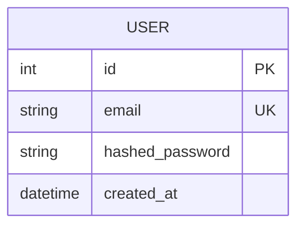

# Project Specification Template

## Overview

**Project Name**: [Name]
**Version**: 1.0.0
**Last Updated**: [Date]

### Description
[Brief description of the project and its purpose]

### Target Users
[Who will use this application]

---

## Functional Requirements

### Core Features

| ID | Feature | Priority | Description |
|----|---------|----------|-------------|
| FR-001 | [Feature Name] | High | [Description] |
| FR-002 | [Feature Name] | High | [Description] |
| FR-003 | [Feature Name] | Medium | [Description] |

### User Stories

#### US-001: [User Story Title]
**As a** [user type]
**I want** [goal]
**So that** [benefit]

**Acceptance Criteria:**
- [ ] Criterion 1
- [ ] Criterion 2
- [ ] Criterion 3

#### US-002: [User Story Title]
**As a** [user type]
**I want** [goal]
**So that** [benefit]

**Acceptance Criteria:**
- [ ] Criterion 1
- [ ] Criterion 2

---

## Non-Functional Requirements

### Performance
| ID | Requirement | Target |
|----|-------------|--------|
| NFR-001 | API Response Time | < 200ms (p95) |
| NFR-002 | Page Load Time | < 3s |
| NFR-003 | Concurrent Users | 100+ |

### Security
| ID | Requirement | Standard |
|----|-------------|----------|
| NFR-004 | Authentication | JWT + OAuth2 |
| NFR-005 | Data Encryption | AES-256 at rest |
| NFR-006 | OWASP Compliance | Top 10 2021 |

### Scalability
- Horizontal scaling capability
- Stateless backend design
- Database connection pooling

---

## Technical Specification

### Tech Stack

| Layer | Technology | Rationale |
|-------|------------|-----------|
| Backend | FastAPI + SQLAlchemy | High performance, type safety |
| Frontend | React + shadcn/ui | Component library, Tailwind |
| Database | PostgreSQL | ACID compliance, JSON support |
| Auth | JWT + OAuth2 | Stateless, industry standard |

### API Endpoints

| Method | Endpoint | Description |
|--------|----------|-------------|
| POST | /api/auth/login | User login |
| POST | /api/auth/register | User registration |
| GET | /api/users | List users |
| GET | /api/users/{id} | Get user detail |

### Database Schema

---

## Constraints & Assumptions

### Constraints
- [Constraint 1]
- [Constraint 2]

### Assumptions
- [Assumption 1]
- [Assumption 2]

---

## Out of Scope

The following are explicitly NOT included:
- [Feature/capability not included]
- [Another exclusion]

---

## Milestones

| Milestone | Deliverables | Status |
|-----------|--------------|--------|
| M1: Foundation | Project setup, DB schema | Pending |
| M2: Core API | CRUD endpoints, auth | Pending |
| M3: Frontend | UI components, integration | Pending |
| M4: Testing | Unit, integration, E2E tests | Pending |
| M5: Deployment | CI/CD, Docker, docs | Pending |

---

## Appendix

### Glossary
- **Term**: Definition

### References
- [Link to related documentation]
