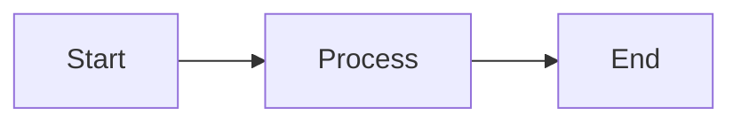

# Slidev Presentations

Create markdown-based presentation slides for developers using Slidev framework.

## Quick Start

### Create New Presentation
```bash
# Initialize new project
npm init slidev@latest

# Or use global CLI
npm i -g @slidev/cli
slidev slides.md
```

### Basic Slide Structure
```markdown
---
theme: default
title: My Presentation
---

# Slide 1 Title

Content here

---

# Slide 2 Title

More content
```

## Slide Syntax

### Frontmatter (First Slide)
Configure entire presentation:
```yaml
---
theme: default          # Theme name
title: Presentation     # Title for SEO
layout: cover           # First slide layout
background: /image.jpg  # Background image
class: text-center      # CSS classes
---
```

### Per-Slide Frontmatter
```yaml
---
layout: two-cols
transition: slide-left
---
```

### Slide Separators
Use `---` with blank lines before and after to separate slides.

## Built-in Layouts

| Layout | Use Case |
|--------|----------|
| `default` | Standard content |
| `cover` | Title slide |
| `center` | Centered content |
| `two-cols` | Side-by-side content |
| `image` | Full image |
| `image-left` | Image left, content right |
| `image-right` | Content left, image right |
| `quote` | Quotations |
| `section` | Section dividers |
| `fact` | Highlight key data |
| `statement` | Bold statements |
| `full` | Use entire screen |
| `iframe` | Embed web pages |
| `end` | Final slide |

### Two-Column Layout
```markdown
---
layout: two-cols
---

# Left Column

Content here

::right::

# Right Column

More content
```

## Code Blocks

### Basic Highlighting
````markdown
```ts {2,3}
function greet() {
  const name = 'World'   // highlighted
  console.log(name)      // highlighted
}
```
````

### Line Ranges
- `{1,3}` - Lines 1 and 3
- `{1-3}` - Lines 1 to 3
- `{1,3-5}` - Line 1 and lines 3-5
- `{*}` - All lines (for click animations)

### Monaco Editor (Live Editing)
````markdown
```ts {monaco}
// Interactive code editor
console.log('Edit me!')
```
````

### Code Runner
````markdown
```ts {monaco-run}
// Executable code
console.log('Run me!')
```
````

## Animations

### Click Animations
```html
<v-click>Appears on click</v-click>

<v-click at="2">Appears on 2nd click</v-click>

<v-clicks>
- Item 1 (click 1)
- Item 2 (click 2)
- Item 3 (click 3)
</v-clicks>
```

### Code Line Animation
````markdown
```ts {1|2|3}
const a = 1  // shown first
const b = 2  // shown on click
const c = 3  // shown on next click
```
````

### Slide Transitions
```yaml
---
transition: slide-left
---
```

Options: `fade`, `fade-out`, `slide-left`, `slide-right`, `slide-up`, `slide-down`

## Diagrams & Math

### Mermaid Diagrams
````markdown

````

### LaTeX Math
```markdown
$E = mc^2$

$$
\int_0^\infty f(x) dx
$$
```

## Speaker Notes

Add notes at end of slide as comments:
```markdown
---

# My Slide

Content here

<!--
These are speaker notes.
Only visible in presenter mode.
-->
```

## Export Commands

```bash
# PDF export
slidev export

# PDF with click animations
slidev export --with-clicks

# PPTX export
slidev export --format pptx

# PNG images
slidev export --format png

# Specific slides
slidev export --range 1,3-5,8

# Dark mode
slidev export --dark

# Custom output
slidev export --output my-slides.pdf
```

## CLI Commands

| Command | Description |
|---------|-------------|
| `slidev` | Start dev server |
| `slidev build` | Build static site |
| `slidev export` | Export to PDF/PPTX/PNG |
| `slidev format` | Format slides.md |
| `slidev --remote` | Enable remote access |

## Popular Themes

Install themes via npm:
```bash
npm i @slidev/theme-seriph
```

Use in frontmatter:
```yaml
---
theme: seriph
---
```

Popular themes: `default`, `seriph`, `apple-basic`, `dracula`, `penguin`, `unicorn`

## Resources

- **Syntax Reference:** See `references/slidev-syntax.md` for complete syntax
- **Layout Details:** See `references/slidev-layouts.md` for layout examples
- **Official Docs:** https://sli.dev
- **Theme Gallery:** https://sli.dev/resources/theme-gallery
