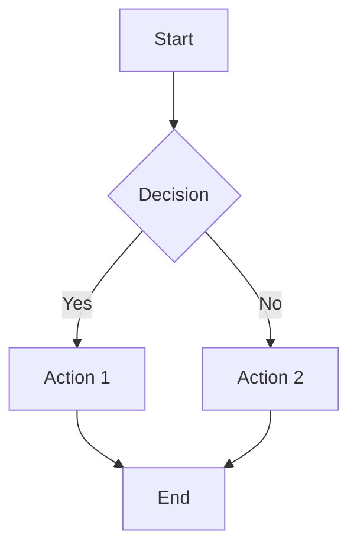
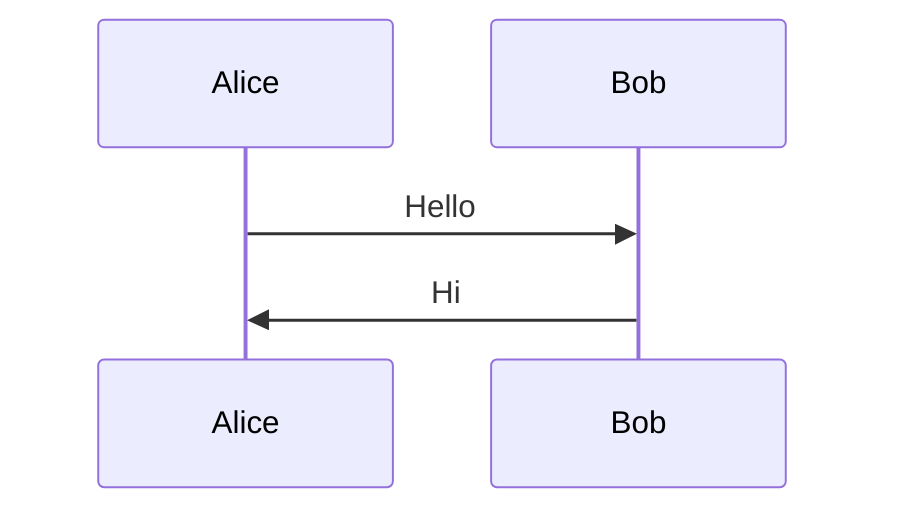
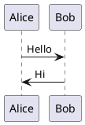

# Slidev Syntax Reference

Complete syntax reference for Slidev markdown presentations.

## Frontmatter Options

### Global Configuration (First Slide)
```yaml
---
theme: default              # Theme package name
title: My Presentation      # SEO title
titleTemplate: '%s - Slidev' # Title template
info: |                     # Presentation info (markdown)
  ## About
  Multi-line description
author: Your Name           # Author name
keywords: keyword1,keyword2 # SEO keywords

layout: cover               # First slide layout
background: /image.jpg      # Background image/color
class: text-center          # CSS classes

transition: slide-left      # Default transition
mdc: true                   # Enable MDC syntax

highlighter: shiki          # Code highlighter
lineNumbers: true           # Show line numbers
monaco: true                # Enable Monaco editor
drawings:
  enabled: true             # Enable drawing mode
  persist: false            # Persist drawings
record: true                # Enable recording

exportFilename: slides      # Export filename
download: true              # Show download button
---
```

### Per-Slide Frontmatter
```yaml
---
layout: center
transition: fade
background: '#1a1a1a'
class: my-custom-class
clicks: 3                   # Total clicks on slide
disabled: false             # Disable slide
hide: false                 # Hide from navigation
hideInToc: true             # Hide from TOC
level: 2                    # Heading level for TOC
preload: true               # Preload slide
routeAlias: intro           # URL alias
src: ./external.md          # Import external file
zoom: 0.5                   # Zoom level (0.1-1)
---
```

## Code Block Syntax

### Basic Code Block
````markdown
```language
code here
```
````

### Line Highlighting
````markdown
```ts {2,3}           // Lines 2 and 3
```ts {1-4}           // Lines 1 to 4
```ts {1,3-5,8}       // Lines 1, 3-5, and 8
```ts {*}             // All lines (animate later)
```ts {2-3|5|7-8}     // Animate: 2-3 → 5 → 7-8
```ts {*|2|3}         // Animate: all → 2 → 3
````

### Code Block Options
````markdown
```ts {2,3} {lines:true}                    // Line numbers
```ts {2,3} {startLine:5}                   // Start from line 5
```ts {2,3} {maxHeight:'200px'}             // Max height
```ts twoslash                              // TypeScript twoslash
```ts {monaco}                              // Monaco editor
```ts {monaco-run}                          // Monaco with runner
```ts {monaco-write}                        // Writable Monaco
```ts {monaco-diff}                         // Monaco diff editor
````

### Import Code from File
````markdown
<<< @/snippets/code.ts                      // Import file
<<< @/snippets/code.ts#region               // Import region
<<< @/snippets/code.ts {2-5}                // With highlight
<<< @/snippets/code.ts ts {2-5|7-9}         // With animation
````

### Code Groups
````markdown
```ts {1|2} name="index.ts"
const a = 1
const b = 2
```

```css name="style.css"
.class { color: red; }
```
````

## Animation Syntax

### v-click Components
```html
<v-click>Content appears on click</v-click>

<v-click at="1">First click</v-click>
<v-click at="2">Second click</v-click>

<v-click at="+1">One after previous</v-click>
<v-click at="+2">Two after previous</v-click>

<v-click hide>Initially visible, hides on click</v-click>
```

### v-clicks for Lists
```html
<v-clicks>

- Item 1
- Item 2
- Item 3

</v-clicks>

<v-clicks depth="2">
- Parent 1
  - Child 1.1
  - Child 1.2
- Parent 2
</v-clicks>
```

### v-after (Sync with Previous)
```html
<v-click>Shows first</v-click>
<v-after>Shows at same time as previous</v-after>
```

### v-motion Directive
```html
<div
  v-motion
  :initial="{ x: -100, opacity: 0 }"
  :enter="{ x: 0, opacity: 1 }"
  :click-1="{ x: 50 }"
  :leave="{ x: 100, opacity: 0 }"
>
  Animated element
</div>
```

## Diagram Syntax

### Mermaid
````markdown

````

### Mermaid Themes
````markdown

````

### PlantUML
````markdown

````

## Math Syntax

### Inline Math
```markdown
The equation $E = mc^2$ is famous.
```

### Block Math
```markdown
$$
\sum_{i=1}^{n} x_i = x_1 + x_2 + \cdots + x_n
$$
```

### Chemical Formulas (via KaTeX)
```markdown
$$
\ce{H2O -> H+ + OH-}
$$
```

## Layout Slot Syntax

### Named Slots
```markdown
---
layout: two-cols
---

Left content

::right::

Right content
```

### Header Slot
```markdown
---
layout: two-cols-header
---

::header::
# This spans both columns

::left::
Left content

::right::
Right content
```

## MDC Syntax

### Inline Styles
```markdown
This is [red text]{style="color:red"}

This has a [tooltip]{title="Hover me"}

This is [important]{.text-red-500 .font-bold}
```

### Block Components
```markdown
::div{.my-class}
Content inside a div
::

:::info
This is an info block
:::
```

## Scoped CSS
```markdown
---

# My Slide

<style>
h1 {
  color: red;
}
</style>
```

## Global CSS
```markdown
---

<style>
:global(.slidev-layout) {
  background: linear-gradient(...);
}
</style>
```
