```mermaid
graph LR
  A[슬라이드 작성] --> B[Slidev 실행]
  B --> C[PDF 내보내기]
  C --> D[발표 완료]
```

# Slidev Presentations Skill

개발자를 위한 마크다운 기반 프레젠테이션

<div class="pt-12">
  <span class="px-2 py-1 rounded bg-white/10">
    Claude Code Skill for Creating Beautiful Slides
  </span>
</div>

<!--
Slidev 프레젠테이션 스킬에 대한 소개 발표입니다.
개발자가 마크다운으로 쉽게 슬라이드를 만들 수 있도록 도와줍니다.
-->

---
layout: section
---

# What is Slidev?

---
layout: two-cols
---

# Slidev란?

**개발자 친화적** 프레젠테이션 프레임워크

<v-clicks>

- 📝 **마크다운 기반** - 익숙한 문법
- 🎨 **테마 지원** - 다양한 디자인
- 🧑‍💻 **코드 하이라이팅** - 실시간 편집
- 📊 **다이어그램** - Mermaid 내장
- 🎬 **애니메이션** - 클릭 기반 효과
- 📤 **다양한 포맷** - PDF, PPTX, PNG

</v-clicks>

::right::

```bash
# 빠른 시작
npm init slidev@latest

# 또는 전역 설치
npm i -g @slidev/cli
slidev slides.md
```

<div v-click class="mt-8">

### 핵심 장점

✅ Git 버전 관리
✅ 코드 리뷰 가능
✅ CI/CD 자동화

</div>

---
layout: center
---

# 기본 슬라이드 구조

```markdown {all|1-6|8-11|13-16}
---
theme: default
title: My Presentation
layout: cover
---

# 첫 번째 슬라이드

슬라이드 내용

---

# 두 번째 슬라이드

다른 내용
```

<arrow v-click="1" x1="400" y1="150" x2="500" y2="150" color="#f59e0b" width="2" />

<!--
슬라이드는 --- 구분자로 나눕니다.
첫 슬라이드의 frontmatter는 전체 설정을 담습니다.
-->

---
layout: section
---

# 주요 기능

---

# 레이아웃 옵션

| Layout | 용도 |
|--------|------|
| `cover` | 타이틀 슬라이드 |
| `center` | 중앙 정렬 콘텐츠 |
| `two-cols` | 좌우 분할 |
| `image` | 전체 이미지 |
| `image-left` | 왼쪽 이미지 |
| `image-right` | 오른쪽 이미지 |
| `quote` | 인용문 |
| `section` | 섹션 구분 |
| `fact` | 핵심 데이터 |

<v-click>

```yaml
---
layout: two-cols
---
```

</v-click>

---

# 코드 하이라이팅

<div class="grid grid-cols-2 gap-4">

<div>

### 라인 하이라이팅

````markdown
```ts {2,3}
function greet() {
  const name = 'World'  // 하이라이트
  console.log(name)     // 하이라이트
}
```
````

</div>

<div>

### 결과

```ts {2,3}
function greet() {
  const name = 'World'
  console.log(name)
}
```

</div>

</div>

<v-click>

<div class="mt-6 grid grid-cols-2 gap-4">

<div>

### 클릭 애니메이션

````markdown
```ts {1|2|3}
const a = 1  // 첫 번째
const b = 2  // 클릭
const c = 3  // 클릭
```
````

</div>

<div>

### Monaco 편집기

````markdown
```ts {monaco}
// 실시간 편집 가능
console.log('Edit me!')
```
````

</div>

</div>

</v-click>

---

# 다이어그램 지원

Mermaid로 다이어그램 작성:

````markdown

````

<div class="mt-4">


</div>

---

# 클릭 애니메이션

<div class="grid grid-cols-2 gap-8">

<div>

### 기본 클릭

```html
<v-click>첫 번째 클릭</v-click>
<v-click>두 번째 클릭</v-click>
```

<v-click>

이 텍스트가 나타납니다

</v-click>

<v-click>

그 다음 이 텍스트가

</v-click>

</div>

<div>

### 리스트 클릭

```html
<v-clicks>
- 항목 1
- 항목 2
- 항목 3
</v-clicks>
```

<v-clicks>

- 첫 번째 항목
- 두 번째 항목
- 세 번째 항목

</v-clicks>

</div>

</div>

---

# 슬라이드 전환 효과

```yaml
---
transition: slide-left
---
```

<div class="grid grid-cols-3 gap-4 mt-8">

<v-clicks>

<div class="p-4 bg-blue-500/20 rounded-lg text-center">

**fade**

부드러운 페이드

</div>

<div class="p-4 bg-green-500/20 rounded-lg text-center">

**slide-left**

왼쪽으로 슬라이드

</div>

<div class="p-4 bg-purple-500/20 rounded-lg text-center">

**slide-up**

위로 슬라이드

</div>

</v-clicks>

</div>

---
layout: section
---

# 내보내기 & CLI

---

# 내보내기 명령어

```bash {1|3|5|7|9}
# PDF 내보내기
slidev export

# 클릭 애니메이션 포함
slidev export --with-clicks

# PPTX 형식
slidev export --format pptx

# PNG 이미지
slidev export --format png
```

<v-click>

### 추가 옵션

```bash
# 특정 슬라이드만
slidev export --range 1,3-5,8

# 다크 모드
slidev export --dark
```

</v-click>

---

# CLI 명령어 요약

| 명령어 | 설명 |
|--------|------|
| `slidev` | 개발 서버 시작 |
| `slidev build` | 정적 사이트 빌드 |
| `slidev export` | PDF/PPTX/PNG 내보내기 |
| `slidev format` | slides.md 포맷팅 |
| `slidev --remote` | 원격 접속 활성화 |

<v-click>

<div class="mt-6 p-4 bg-yellow-500/20 rounded-lg">

💡 **Tip**: `slidev --remote`로 휴대폰에서도 발표 노트를 볼 수 있습니다!

</div>

</v-click>

---
layout: section
---

# Claude Code Skill 활용

---

# 스킬 사용 방법

<v-clicks>

1. **스킬 호출**
   - "slidev로 발표 자료 만들어줘"
   - "프레젠테이션 슬라이드 생성해줘"

2. **자동 지원**
   - 마크다운 슬라이드 생성
   - 코드 하이라이팅 설정
   - 다이어그램 포함

3. **내보내기 안내**
   - PDF 변환 명령어
   - PPTX 생성 가이드

</v-clicks>

<v-click>

```bash
# 프로젝트 생성 후 실행
npm init slidev@latest
cd my-presentation
npm run dev
```

</v-click>

---
layout: two-cols
---

# 활용 예시

### 기술 발표

<v-clicks>

- API 문서 설명
- 아키텍처 다이어그램
- 코드 리뷰 발표

</v-clicks>

<v-click>

### 팀 미팅

- 스프린트 회고
- 기술 공유
- 온보딩 자료

</v-click>

::right::

<div class="ml-4">

### 장점

<v-clicks>

✅ 마크다운으로 빠른 작성

✅ Git으로 버전 관리

✅ 코드와 슬라이드 동기화

✅ CI/CD로 자동 배포

✅ 테마로 일관된 디자인

</v-clicks>

</div>

---
layout: center
class: text-center
---

# 시작하기

<div class="text-2xl mb-8">

```bash
npm init slidev@latest
```

</div>

<v-click>

### 리소스

[공식 문서](https://sli.dev) · [테마 갤러리](https://sli.dev/resources/theme-gallery) · [예제 모음](https://sli.dev/showcases)

</v-click>

---
layout: end
---

# 감사합니다!

Slidev로 개발자다운 발표를 시작하세요 🚀

<div class="mt-8 text-sm opacity-70">

Made with Slidev Presentations Skill for Claude Code

</div>
