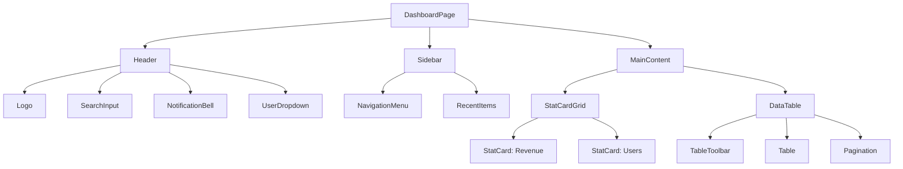
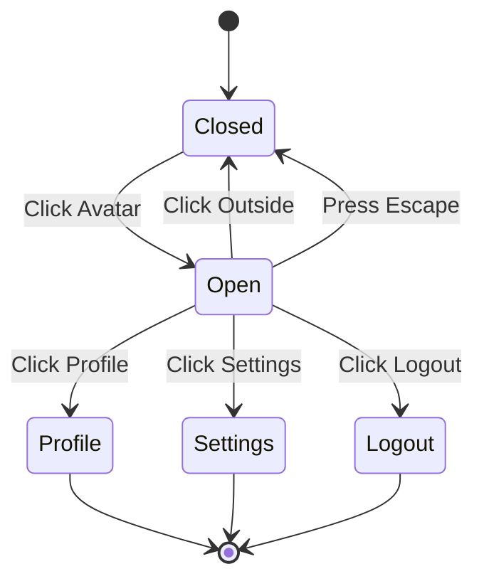

# Wireframe Design Studio

Premium wireframe design skill with hierarchical multi-agent architecture for shadcn/ui.

## Architecture Overview

```
┌─────────────────────────────────────────────────────────────────────────┐
│                    WIREFRAME DESIGN ORCHESTRATOR                         │
├─────────────────────────────────────────────────────────────────────────┤
│ Phase 1: DISCOVER ──► Deep requirement analysis + domain research        │
│   └── RequirementAnalyzer Agent (AskUserQuestion flow)                  │
│   └── DomainResearcher Agent (WebSearch UI/UX trends)                   │
│   └── ComponentScanner Agent (shadcn/ui component matching)             │
│ Phase 2: DESIGN ──► Layout structure + component selection               │
│   └── LayoutArchitect Agent (page structure, grid system)               │
│   └── ComponentSelector Agent (shadcn/ui mapping)                       │
│   └── Save to .wireframe-docs/designs/                                  │
│ Phase 3: SPEC ──► Component specifications + accessibility               │
│   └── SpecGenerator Agent (props, state, events)                        │
│   └── A11yAuditor Agent (WCAG checklist)                                │
│   └── ResponsiveMapper Agent (breakpoint definitions)                   │
│   └── Save to .wireframe-docs/specs/                                    │
│ Phase 4: BUILD ──► Task breakdown + implementation guide                 │
│   └── TaskGenerator Agent (atomic implementation tasks)                 │
│   └── FlowDesigner Agent (interaction sequences)                        │
│   └── Save to .wireframe-docs/tasks/                                    │
└─────────────────────────────────────────────────────────────────────────┘
```

## Quick Start

```bash
# Start new wireframe project
/wire-start "사용자 대시보드"

# Get next implementation task
/wire-next

# Check current status
/wire-status

# View specific wireframe
/wire-view dashboard-main

# List all wireframes
/wire-list

# Search wireframes
/wire-search "sidebar"
```

## Document Persistence Structure

All outputs saved to `.wireframe-docs/` directory:

```
.wireframe-docs/
├── index.md                      # Searchable index
├── config.json                   # Project configuration
│
├── discovery/                    # Phase 1 outputs
│   ├── requirements.md           # User requirements analysis
│   ├── domain_research.md        # UI/UX trend findings
│   ├── component_candidates.md   # shadcn/ui component matches
│   └── user_decisions.md         # AskUserQuestion responses
│
├── designs/                      # Phase 2 outputs
│   ├── {screen}/
│   │   ├── layout.md             # Grid structure, sections
│   │   ├── wireframe.md          # ASCII/Mermaid wireframe
│   │   └── components.md         # Component hierarchy
│
├── specs/                        # Phase 3 outputs
│   ├── {screen}/
│   │   ├── component_specs.md    # Props, state, events
│   │   ├── a11y_checklist.md     # Accessibility requirements
│   │   └── responsive.md         # Breakpoint definitions
│
├── tasks/                        # Phase 4 outputs
│   ├── TASK-001.md
│   ├── TASK-002.md
│   └── ...
│
└── tracking/                     # Progress tracking
    ├── completion_status.json    # Task status
    ├── wireframe_registry.json   # All wireframes index
    └── verification_log.md       # History
```

## Phase 1: DISCOVER

### Step 1.1: Deep Requirement Analysis

Use AskUserQuestion to understand the wireframe needs:

```
AskUserQuestion(questions=[
  {
    "question": "이 화면의 주요 목적은 무엇인가요?",
    "header": "Purpose",
    "options": [
      {"label": "데이터 조회/분석", "description": "대시보드, 리포트, 차트"},
      {"label": "데이터 입력/관리", "description": "폼, CRUD 작업"},
      {"label": "콘텐츠 탐색", "description": "리스트, 카드, 검색"},
      {"label": "사용자 인터랙션", "description": "설정, 프로필, 알림"}
    ],
    "multiSelect": true
  },
  {
    "question": "핵심 컴포넌트는 무엇인가요?",
    "header": "Components",
    "options": [
      {"label": "네비게이션 (Sidebar/Header)", "description": "메뉴, 브레드크럼"},
      {"label": "데이터 테이블", "description": "정렬, 필터, 페이지네이션"},
      {"label": "폼/입력", "description": "텍스트, 셀렉트, 날짜"},
      {"label": "카드/타일", "description": "정보 요약, 통계"}
    ],
    "multiSelect": true
  },
  {
    "question": "상호작용 복잡도는?",
    "header": "Complexity",
    "options": [
      {"label": "단순 (정적 표시)", "description": "읽기 전용, 최소 인터랙션"},
      {"label": "보통 (기본 CRUD)", "description": "생성/수정/삭제 작업"},
      {"label": "복잡 (다중 상태)", "description": "조건부 UI, 실시간 업데이트"},
      {"label": "고급 (워크플로우)", "description": "멀티스텝, 드래그앤드롭"}
    ],
    "multiSelect": false
  }
])
```

### Step 1.2: Domain Research

Launch parallel research agents:

```
# Agent 1: UI/UX Trends
Task(
  subagent_type='general-purpose',
  description='Research UI trends',
  prompt='''Use WebSearch to find:
    - "{screen_type} UI design trends 2025"
    - "{screen_type} best practices shadcn"
    - "{domain} dashboard examples"

    Return: patterns, layouts, component recommendations
  ''',
  model='haiku',
  run_in_background=true
)

# Agent 2: shadcn/ui Component Matching
Task(
  subagent_type='general-purpose',
  description='Match shadcn components',
  prompt='''Analyze requirements and map to shadcn/ui:
    - Core components needed
    - Composition patterns
    - Variant recommendations

    Reference: https://ui.shadcn.com/docs/components
  ''',
  model='haiku',
  run_in_background=true
)
```

## Phase 2: DESIGN

### Step 2.1: Layout Architecture

Define page structure with grid system:

```markdown
## Layout Structure: {screen_name}

### Grid System

- Container: max-w-7xl mx-auto
- Columns: 12-column grid
- Gutter: gap-4 (16px)

### Sections

┌─────────────────────────────────────────────┐
│ HEADER (h-16, sticky) │
├─────────┬───────────────────────────────────┤
│ SIDEBAR │ MAIN CONTENT │
│ w-64 │ flex-1 │
│ │ ┌─────────────────────────────┐ │
│ │ │ SECTION 1 (Cards) │ │
│ │ └─────────────────────────────┘ │
│ │ ┌─────────────────────────────┐ │
│ │ │ SECTION 2 (Table) │ │
│ │ └─────────────────────────────┘ │
└─────────┴───────────────────────────────────┘
```

### Step 2.2: ASCII Wireframe

Generate detailed wireframe:

```
┌──────────────────────────────────────────────────────────────┐
│ ◀ Logo          [Search...          🔍]    🔔  👤 Admin ▼   │
├─────────┬────────────────────────────────────────────────────┤
│ 📊 Dash │  Dashboard                              [+ New] ▼  │
│ 👥 Users├────────────────────────────────────────────────────┤
│ 📁 Files│  ┌──────────┐ ┌──────────┐ ┌──────────┐ ┌────────┐ │
│ ⚙ Sett │  │ 📈 12.5K │ │ 👥 1,234 │ │ 💰 $45K  │ │ 📊 89% │ │
│         │  │ Revenue  │ │ Users    │ │ Sales    │ │ Growth │ │
│─────────│  └──────────┘ └──────────┘ └──────────┘ └────────┘ │
│ RECENT  │  ┌────────────────────────────────────────────────┐ │
│ • Item1 │  │ [Filter ▼] [Date Range] [Export]    🔍 Search │ │
│ • Item2 │  ├────────────────────────────────────────────────┤ │
│ • Item3 │  │ ☐ │ Name        │ Status  │ Date    │ Action │ │
│         │  │ ☐ │ Project A   │ 🟢 Act  │ Dec 28  │ •••    │ │
│         │  │ ☐ │ Project B   │ 🟡 Pend │ Dec 27  │ •••    │ │
│         │  │ ☐ │ Project C   │ 🔴 Stop │ Dec 26  │ •••    │ │
│         │  └────────────────────────────────────────────────┘ │
│         │  [◀] Page 1 of 10 [▶]                              │
└─────────┴────────────────────────────────────────────────────┘
```

### Step 2.3: Component Hierarchy

````markdown
## Component Hierarchy


````

````

## Phase 3: SPEC

### Step 3.1: Component Specifications

Generate detailed specs for each component:

```markdown
## Component Spec: StatCard

### shadcn/ui Base
- Card, CardHeader, CardContent, CardTitle

### Props Interface
| Prop      | Type                    | Required | Default   | Description           |
|-----------|-------------------------|----------|-----------|----------------------|
| title     | string                  | Yes      | -         | Card title           |
| value     | string \| number        | Yes      | -         | Main metric value    |
| icon      | LucideIcon              | No       | null      | Leading icon         |
| trend     | {value: number, dir}    | No       | null      | Trend indicator      |
| variant   | 'default'\|'success'    | No       | 'default' | Visual variant       |

### State Management
| State     | Type    | Initial | Trigger              |
|-----------|---------|---------|----------------------|
| isLoading | boolean | false   | Data fetch           |
| error     | Error   | null    | Fetch failure        |

### Events
| Event     | Payload | Description           |
|-----------|---------|----------------------|
| onClick   | void    | Card click handler    |
| onRefresh | void    | Refresh data         |

### Usage Example
```tsx
<StatCard
  title="Revenue"
  value="$12,500"
  icon={DollarSign}
  trend={{ value: 12.5, direction: 'up' }}
  variant="success"
/>
````

````

### Step 3.2: Accessibility Checklist

```markdown
## A11y Checklist: {screen_name}

### Keyboard Navigation
- [ ] All interactive elements focusable (Tab order)
- [ ] Focus visible indicator (ring-2 ring-offset-2)
- [ ] Escape closes modals/dropdowns
- [ ] Arrow keys for menu navigation

### Screen Reader
- [ ] Semantic HTML (header, nav, main, section)
- [ ] ARIA labels on icon-only buttons
- [ ] Live regions for dynamic content (aria-live)
- [ ] Table headers with scope

### Visual
- [ ] Color contrast ratio ≥ 4.5:1 (text)
- [ ] Color contrast ratio ≥ 3:1 (UI components)
- [ ] No color-only information
- [ ] Resize up to 200% without loss

### Forms
- [ ] Labels associated with inputs
- [ ] Error messages linked (aria-describedby)
- [ ] Required fields marked (aria-required)
- [ ] Validation feedback accessible
````

### Step 3.3: Responsive Breakpoints

```markdown
## Responsive Design: {screen_name}

### Breakpoint Definitions

| Breakpoint | Width    | Layout Changes                   |
| ---------- | -------- | -------------------------------- |
| mobile     | < 640px  | Stack layout, hidden sidebar     |
| tablet     | 640-1024 | Collapsible sidebar, 2-col cards |
| desktop    | > 1024px | Full sidebar, 4-col cards        |

### Component Adaptations

#### Header

- mobile: Hamburger menu, hidden search
- tablet: Compact search, icon-only nav
- desktop: Full search, complete nav

#### Sidebar

- mobile: Drawer (Sheet component)
- tablet: Collapsed icons only
- desktop: Full expanded

#### StatCards

- mobile: 1 column, full width
- tablet: 2 columns
- desktop: 4 columns

#### DataTable

- mobile: Card view (responsive mode)
- tablet: Horizontal scroll
- desktop: Full table
```

## Phase 4: BUILD

### Step 4.1: Task Generation

Generate atomic implementation tasks:

```markdown
# TASK-001: Setup Dashboard Layout

## Metadata

| Field        | Value              |
| ------------ | ------------------ |
| ID           | TASK-001           |
| Screen       | dashboard-main     |
| Priority     | 1                  |
| Complexity   | Low                |
| Status       | pending            |
| Dependencies | -                  |
| Blocks       | TASK-002, TASK-003 |

## Description

Create the base dashboard layout with header, sidebar, and main content area.

## shadcn/ui Components

- Sheet (mobile sidebar)
- NavigationMenu
- DropdownMenu
- Button

## Files to Create

| File                             | Purpose           |
| -------------------------------- | ----------------- |
| app/dashboard/layout.tsx         | Dashboard layout  |
| components/dashboard/header.tsx  | Header component  |
| components/dashboard/sidebar.tsx | Sidebar component |

## Acceptance Criteria

- [ ] Responsive layout (mobile/tablet/desktop)
- [ ] Sidebar toggle on mobile
- [ ] Sticky header
- [ ] Proper semantic HTML

## Implementation Notes

- Use flex layout with min-h-screen
- Sidebar width: w-64 (desktop), w-0 (mobile)
- Header height: h-16
```

### Step 4.2: Interaction Flow

````markdown
## Interaction Flow: User Menu


````

### States

| State   | UI Representation   |
| ------- | ------------------- |
| Closed  | Avatar button only  |
| Open    | Dropdown visible    |
| Loading | Spinner in dropdown |

### Transitions

| From   | To      | Trigger       | Action            |
| ------ | ------- | ------------- | ----------------- |
| Closed | Open    | onClick       | Show dropdown     |
| Open   | Closed  | onBlur/Escape | Hide dropdown     |
| Open   | Profile | Click Profile | Navigate /profile |
| Open   | Logout  | Click Logout  | Call logout API   |

```

## Slash Commands

| Command                  | Purpose                          |
| ------------------------ | -------------------------------- |
| `/wire-start {screen}`   | Start new wireframe              |
| `/wire-next`             | Get next task with verification  |
| `/wire-status`           | Show current progress            |
| `/wire-view {screen}`    | View specific wireframe          |
| `/wire-list`             | List all wireframes              |
| `/wire-search {query}`   | Search wireframe docs            |
| `/wire-spec {component}` | View component specification     |

## Scripts

| Script                | Purpose                    |
| --------------------- | -------------------------- |
| `wireframe_manager.py`| Document persistence       |
| `task_tracker.py`     | Task status management     |
| `spec_generator.py`   | Component spec generation  |
| `search_docs.py`      | Full-text search           |

## Trigger Phrases

- "wireframe", "와이어프레임", "화면 설계"
- "UI design", "UI 디자인", "화면 디자인"
- "컴포넌트 설계", "레이아웃 설계"
- "shadcn 컴포넌트", "대시보드 설계"
- `/wire-start`, `/wire-next`, `/wire-status`
```
